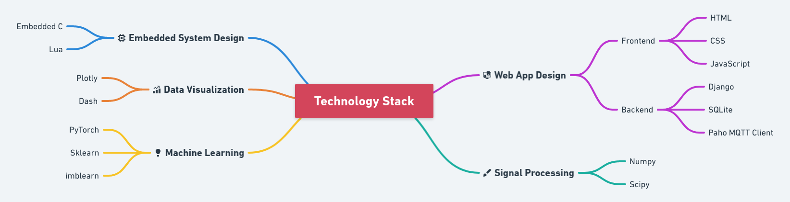

# SmartHospital

Major Project for the year 2020-21 under Electronics & Communication Engineering, National Institute of Technology Karnataka

## Demo

---

Check out a quick demonstration of of our project at https://www.youtube.com/watch?v=sNxa3SpIbTA!

Check out the website at https://smart-hospital-server.herokuapp.com/!

For more information about the web server we have used, refer to my other repo - https://github.com/SakshatRao/SmartHospitalServer

## Brief Description

---

Creating an embedded system ecosystem for hospitals that can facilitate better service to patients and doctors and ultimately improve Quality of Care (QoC). Trying to develop a ‘Smart Hospital’ environment by applying Internet of Things (IoT) in a hospital-specific workplace. Demonstrating how embedded systems can assist doctors, comfort patients and make diagnosis, prognosis & treatment more efficient.

## Features Implemented

---

- **Web Server**: The web server was developed in Django with frontend development being done in HTML, CSS and JavaScript. The website is where EHR records can be added and shared, where patient health can be wirelessly, remotely and continuously monitored and where administration can find insightful statistics about the hospital. MQTT is used to transmit patient vitals from the embedded system to the web server database.

- **Dashboards**: There are different dashboards for patients, doctors/nurses and hospital administration. Each dashboard provides a simple interface to access relevant functionality.
- **Continuous Remote Patient Health Monitoring**: Patient temperature, SpO2, BPM & ECG can be monitored and the values can be transmitted wirelessly to the web server for nurses to monitor patients remotely. Appropriate sensors have been used to measure the vital measurements, process them and finally transmit the information.
- **ECG Processing & Display**: ECG signals are recorded through electrodes, processed using Digital Signal Processing and visualized through customized ECG displays. Further, we can detect the Q, R & S points in the ECG and also try classifying the type of heartbeat of the patient. This is done through RNN-based Neural Networks.

- **Electronic Health Records**: Prescriptions, medical history and hospital billings can be integrated to the EHR model. The website contains a simple interface for doctors to add EHR entries for a patient and for patients to view all their EHR entries. As part of the future work, open EHR specifications like OpenEHR can be adopted in such scenarios.
- **Smart Sanitizers**: A simple yet efficient device to ensure sanitization regulations within the hospital (which is necessary to prevent cross-contamination). By attaching IR sensors to the door, the sanitizer is able to identify an incomer and alert him/her about using the sanitizer. The alert stops either after the sanitizer is used or after a pre-determined timeout. It is simple, inexpensive yet efficient at encouraging regular sanitization.
