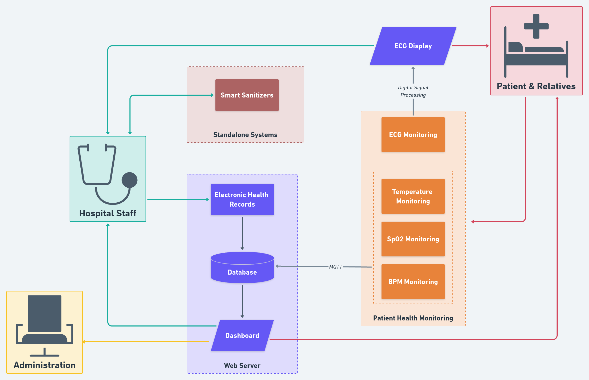

# SmartHospital

Major Project for the year 2020-21 under Electronics & Communication Engineering, National Institute of Technology Karnataka, guided by Dr. M.S. Bhat

## Brief Description

---

Creating an embedded system ecosystem for hospitals that can facilitate better service to patients and doctors and ultimately improve Quality of Care (QoC). Trying to develop a ‘Smart Hospital’ environment by applying Internet of Things (IoT) in a hospital-specific workplace. Demonstrating how embedded systems can assist doctors, comfort patients and make diagnosis, prognosis & treatment more efficient.

## Features Implemented

---

- Web Server
- Dashboards
- Continuous Remote Patient Health Monitoring Device
- ECG Processing & Display
- Smart Sanitizers
- Electronic Health Records

